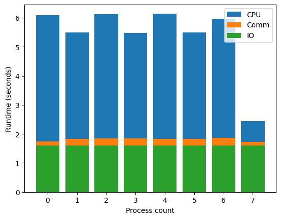
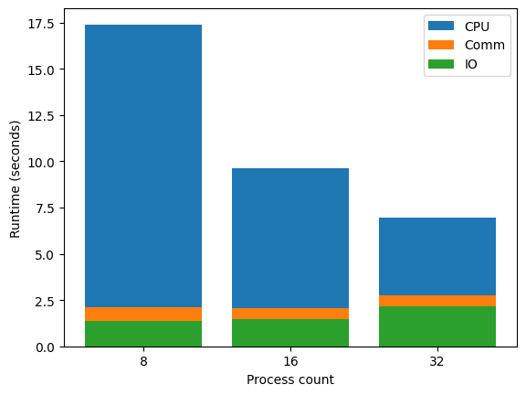
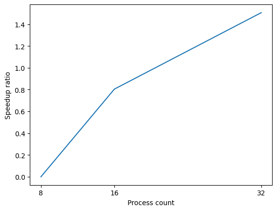

# Bitonic Merge Sort

Name: 呂宣陽
Email: 93wilsonlu@gmail.com

- [Bitonic Merge Sort](#bitonic-merge-sort)
  - [Implementation](#implementation)
    - [Process 溝通](#process-溝通)
    - [OpenMP 加速](#openmp-加速)
  - [Experiment \& Analysis](#experiment--analysis)
    - [System, Environment Spec](#system-environment-spec)
    - [Performance Metrics](#performance-metrics)
    - [Speedup Factor \& Profile](#speedup-factor--profile)
  - [Experiences \& Conclusion](#experiences--conclusion)


## Implementation

實作主要有「Process 溝通」和「OpenMP 加速」兩個重點。

先解釋 Bitonic Merge Sort 的作法，假設有一長度 n=8 的 bitonic array。
```
2 3 5 7 11 8 4 2
```
遍歷前 n/2 個數字，若 `a[i] > a[i+n/2]` 則交換 `a[i]` 和 `a[i+n/2]`。

它會變成兩個 bitonic array，且前 n/2 個數字必小於後 n/2 個數字。
```
2 3 4 2 11 8 5 7
```
對左右兩個 array 再做同樣操作（這時 n=4），一直做到 n=1，形成遞增數列。
```
Init  : 2   3   5   7   11   8   4   2

Step 1: 2   3   4   2 | 11   8   5   7

Step 2: 2   2 | 4   3 | 5   7 | 11   8

Step 3: 2 | 2 | 3 | 4 | 5 | 7 | 8 | 11
```

也就是以下程式：

```c++
for (int k = n >> 1; k > 0; k >>= 1) {
    for (int i = 0; i < n; i++) {
        int j = i ^ k;
        if (i < j && j < n && chunk[i] > chunk[j]) {
            std::swap(chunk[i], chunk[j]);
        }
    }
}
```

一開始 `a[i]` 和 `a[i+n/2]` 比對，接著 `a[i]` 和 `a[i+n/4]` 比對，而使用 `i ^ k` 以及 `if (i < j)` 是為了確保不相關數字不被比對到。

若能排序兩個長度 n/2 的數組，必能組合成長度 n 的雙調數列再排序，最後變成遞增數列。

```c++
for (int step = 2; step <= n; step <<= 1) {
    for (int k = step >> 1; k > 0; k >>= 1) {
        for (int i = 0; i < n; i++) {
            int j = i ^ k;
            if (i < j && j < n &&
                (i & step ? chunk[i] < chunk[j] : chunk[i] > chunk[j])) {
                std::swap(chunk[i], chunk[j]);
            }
        }
    }
}
```

### Process 溝通
假設有 8 個 Process 負責待處理序列的各個部分（以中括號表示由同一 Process 處理）：
```
Proc0 Proc1 ...                           Proc7
[8 4] [9 3] [9 5] [2 5] [7 4] [0 2] [1 1] [6 7]
```
每個 Process 先將其負責內容排序（至於怎麼做後面會講），兩兩形成雙調數列。

例如：Proc0 遞增，Proc1 遞減。
```
Proc0 Proc1 ...                           Proc7
[4 8] [9 3] [5 9] [5 2] [4 7] [2 0] [1 1] [7 6]
```

將 Proc_2i 和 Proc_2i+1 的資料合併，變成 Proc0, Proc1 遞增，Proc2, Proc3 遞減...以此類推，每四個 Process 形成更大的雙調數列。

```
Proc0 Proc1 ...                           Proc7
[4 3] [8 9] [9 5] [5 2] [0 2] [4 7] [7 6] [1 1]
```

如此做到最後，便能排序所有數字，如同一般的 Bitonic Merge Sort。

不過每個 step 結束前，Process 內的資料會變成雙調數列，須排序成遞增/遞減數列。

```c++
// size: Process 數量
// chunk: 當前 Process 負責的資料
// chunksize: 當前 Process 負責的資料長度
// merge(): 將一個雙調數列變成兩個雙調數列

for (int step = 2; step <= size; step <<= 1) {
    descend = rank & step;
    for (int k = step >> 1; k > 0; k >>= 1) {
        if (rank & k) { // 判斷負責發送資料 or 處理別人給的資料
            send(rank - k, chunk, chunksize);
            recv(rank - k, chunk, chunksize); // 示意用，實際上用 MPI
        } else {
            recv(rank + k, chunk, chunksize);

            merge(chunk, chunksize << 1, descend);

            send(rank + k, chunk, chunksize);
        }
    }
    sort_from_bitonic_array(chunk, chunksize, descend);
}
```

不過這種做法將 merge 全部放到一邊 Process，讓雙方交換資料再 merge，可降低運行時間。

```c++
for (int step = 2; step <= size; step <<= 1) {
    descend = rank & step;
    for (int k = step >> 1; k > 0; k >>= 1) {
        if (rank & k) {
            sendrecv(rank - k, chunk, chunksize >> 1);

            merge(chunk, chunksize, descend);

            sendrecv(rank - k, chunk, chunksize >> 1);
        } else {
            sendrecv(rank + k, chunk + (chunksize >> 1), chunksize >> 1);

            merge(chunk, chunksize, descend);

            sendrecv(rank + k, chunk + (chunksize >> 1), chunksize >> 1);
        }
    }
    sort_from_bitonic_array(chunk, chunksize, descend);
}
```

### OpenMP 加速
參考 sequential 版的 Bitonic Merge Sort。

前兩個 for 迴圈是演算法步驟，不可平行化，將 OpenMP 用於最裡面可平行化的部分。
```c++
void bitonic_sort(double* chunk, int chunksize, int descending) {
    for (int step = 2; step <= chunksize; step <<= 1) {
        for (int k = step >> 1; k > 0; k >>= 1) {
#pragma omp parallel for
            for (int i = 0; i < chunksize; i++) {
                int j = i ^ k;
                if (i < j && j < chunksize &&
                    ((step == chunksize ? descending : i & step)
                         ? chunk[i] < chunk[j]
                         : chunk[i] > chunk[j])) {
                    std::swap(chunk[i], chunk[j]);
                }
            }
        }
    }
}
```
而 Process 溝通時用到的 `merge()`, `sort_from_bitonic_array()` 也比照辦理。

## Experiment & Analysis

### System, Environment Spec
- Queue: ct160
- Node count: 1
- Process count: 8
- Core count: 40
- Library
  - gcc/7.5.0
  - openmpi-4.0.5
  - libunwind-1.8.1
  - mpiP-3.5
- Testcase: input4 (n=110590032)

### Performance Metrics
Profiling 使用的資料為 [mpiP](./40_8/profile.mpiP) 的結果。
在 Callsite Time statistics 欄位，可檢視每個 Process 運行 MPI function 的時間。
```
Name              Site Rank  Count      Max     Mean      Min   App%   MPI%
Barrier              1    0      1     3.84     3.84     3.84   0.07   0.23
Barrier              1    1      1     48.4     48.4     48.4   0.84   1.99

...

File_close           3    0      1   0.0694   0.0694   0.0694   0.00   0.00
File_close           3    1      1    0.243    0.243    0.243   0.00   0.01
...
```
將每個 Process 運行 Send, Recv, Sendrecv_replace 的時間總和視為 Communication Time。

而 File_open, File_close, File_read_at, File_write_at 視為 IO Time。

[mpiP](./40_8/profile.mpiP) 的 MPI Time 欄位有紀錄 AppTime (總體運行時間) 和 MPITime (花在 MPI 的時間)，相減即為 CPU Time。

（表中無納入 MPI_Init 和 MPI_Finalize 時間）



表中顯示 Process 7 的 CPU Time 特別低，這並非平行效率差導致。
本測資共有 110590032 個數字，程式會將長度擴展至 2 的冪次，也就是 134217728，而多餘的長度由 `__DBL_MAX__` 來補。
Process 7 的內容都是 `__DBL_MAX__`，因此不需先做 bitonic sort，省下很多時間。

不過，Process 7 須等待其他 Process 排序完才能溝通，這段時間會被算進 Communication Time。解法是呼叫 MPI_Barrier，mpiP 將等待時間歸於 Barrier，即可算出正確的 Communication Time。

### Speedup Factor & Profile
與上節不同，在此 Core 數量同 Process 數量。

測試過程中，發現 OpenMP 會增加 16 Core 的運行時間，因此在本節禁用 OpenMP。

資料來自 mpiP 的 Aggregate Time, MPI Time，Communication Time, IO Time, CPU Time 計算方法同上。



隨著 Process 數量增加，IO Time 逐漸加重，降低平行化效率。



## Experiences & Conclusion
調試過程中，最大的困難是 parallel 和 sequential code 差異，無法照常使用 gdb。

雖然網路上能找到 gdb 調試 MPI 的方法，不過台灣衫一號似乎不能與 node 直接交互，最後我選擇將資訊 print 出來。

本分析結果仍有許多未解釋之處，例如 [Performance Metrics](#performance-metrics) 顯示 Process 0,2,4,6 運行時間較長，經測試發現問題在 `bitonic_sort()`，可能涉及 OpenMP 的實作。

另一方面，OpenMP 會增加 16 Core 程式的影響也相當有趣。最後，這些圖表可能存在瑕疵之處，還需更精準的量測方式以完善結果。